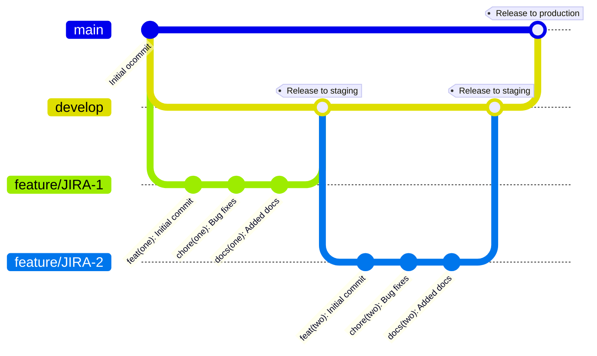

# Branching / release strategy

You can use both release train or feature based releases

## Release train

For release train, you start a new feature branch from `develop`. Once you're ready to release your code you make a pull request against `develop`.
When your code is merged to `develop`, it is automatically deployed to the `staging` environment. You validate your code on there and once everyone is happy you merge
develop into `main` to release to `production`. A `production` release can include multiple features. It's done periodically, e.g. once an hour, once a day, once a week.

This strategy is simple, but has the downside that one feature might prevent another from being released (e.g. `develop` has two features merged into it, feature A is ready to go but feature B has bugs)

## Feature releases

For feature releases, you start your branch from `main`. Once your code is ready, you open a pull request against `develop` and once its merged it is automatically deployed to `staging`.
Once you've validated your code on `staging`, you create a new pull request from your feature branch to `main`. Once it's merged, your changes are automatically deployed to `production`.

This strategy is more complex as it requires multiple pull requests and needs a separate flow to sync `main` and `develop` branches after a feature release, but it allows each release to be deployed independently.

