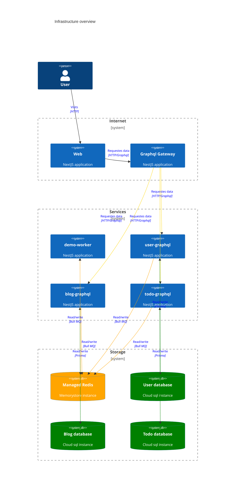

# Infrastructure

We use terraform to set up 2 projects on GCP - staging and production.

## Folder structure

| Directory         | What goes inside of it                                                                                |
| ----------------- | ----------------------------------------------------------------------------------------------------- |
| ./infra/envs/     | All environment definitions go here. What services are configured and how they depends on each other. |
| ./infra/modules/  | All reusable modules go here, e.g. google cloud run definitions.                                      |
| ./infra/services/ | Here we have all of the service definitions                                                           |

## Infrastructure overview

[Open editor](https://mermaid.live/edit#pako:eNq1V1tv2jAU_iuR1QcmQRtIChRpL6VT12mdOtLuJl5McqDREps6Timr-O87jhMI4RbSLRKKMef7vuNzMfYrcbkHpEf6dp8zCS9yyAx8pC8DMG7YWNBIitiVsQCDP4N49mGmTe5ARJzV4ghE3RiSB3wPyTvDGDL9-yWPmUfFvOYjr2AgldVNOlaWr9pOPc48khDWvsNIGeFrSNTgC_rzyTHodBr4LpU-Z6lCAXdNJczoXEGuBZ0-PgVGOpXxRLt5FhsOR2qZLkQK6qTjHQ5z8Vsv34OQN2bJ172a6tmgeUhjqGLZmOgVlPA8x3AZ8ImyH-G7GsM997iyl_g-gmEzel6SQ0dyQSewNWxXo9oAPD-J7y1laOYZyYTWu8VQCjTkWHI-iyRlLmz1GXlU5JynICtAw6OSjmgEmqkf8NgzIiyHQzwqfimPGlbmUVFMedTwGJ4kkno4gCDtq7QjvvmRL9PwfLy_v0PYyjKxybXAAJ5iTBlEifoKdHadZTUHXuKyGqyGzuqvGjqrvVLotNx8xaCdzhXBAKh3NhO-TCN-J_wopEtVjdLO5lJeCqWdzCV4D2q1Ru3hstyLmMs4CIzbr2th0e4dBdG-lYboBWWbVymYBj5MMTGAYEfOA8jX6In67-jzgIv3aheKE4qTwGewmqTu72SWj8cRyB8412iZuZmfasY2l24W1NbrvKKgvUtwq2ShOw5rTnjglZbcJ6iLoJpgt4qgLqFqgs3WUVEtdG2ZTKaTOU1rQ7K9c5GFhv__goW94h8Lrof1QwAhMLkKrZYcTZYZEwCs4OkaaBWYI0Crxe0H7cz6WlHtAxazVxpYzMJ24M4Vpvtibn14pGHJmWb7_rS-n67JZchdtZBL-7m5P4JvpLcOdMnb6A90xNvIc7tYXuMznfMYcWzsT2onru080incsAGfIaapm8i1s_Pp8oeEi9RJCCKkvod3oOSgiifgRyyCIeklp_oxjQO8rQzZAk1pLLkzZy7p4Z0I6iRO9K98iuflkPTGNIhwdkrZL87DzAi_kt4reSG9Rss-7Z63mhfmudW18WO162ROevbFqdWx2u1mt2mZnU7HXtTJn4SheWqanXbXbllm17Rt27LrBEOIR-NbfW1Lbm-Lvz9ZZEs)
