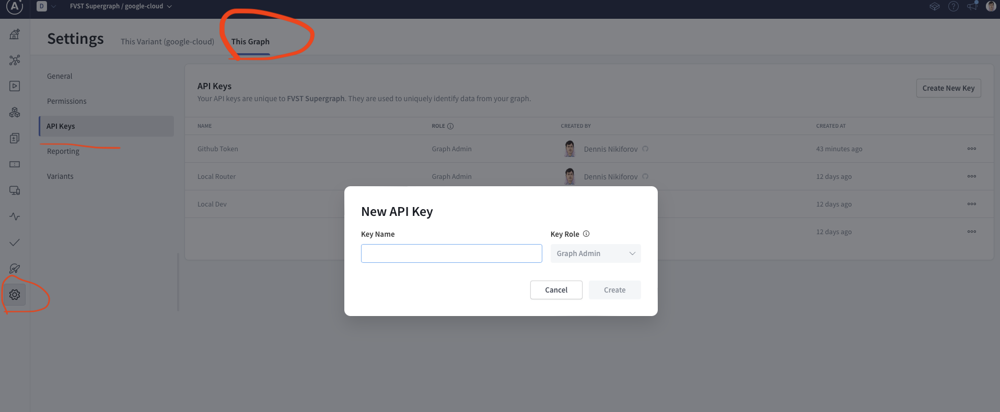
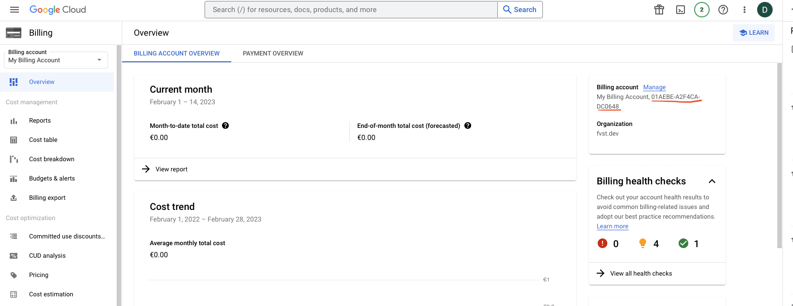
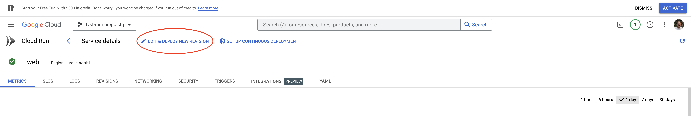

# FVST

## Initial Setup instructions

> NB! Before starting, you need accounts with
>
> - https://cloud.google.com
> - https://studio.apollographql.com/login

Apollo studio account is free for up to 10M requests per month, and you will use the request counter only for development or QA to validate the schema. Production users will not use these requests

Google Cloud has a trial account to get started.

## Apollo Studio Setup

1. Create a new supergraph by providing a schema manually.
2. Create a sample variant of the supergraph and click on the variant.
3. Click on the settings cog in the left lower menu
4. Click on the `This Graph` menu and then navigate to API keys.
5. You should see this information there: 
6. Name the key GitHub Actions Key and save it locally

## Google Cloud Setup

1. Choose a company top level account
2. Navigate to IAM & Admin and click the Manage Resources on the left menu
3. Create a folder under the company name where all environments will go
4. Create a new project and enable the following APIs for it:
   - Service Usage API
   - Cloud Resource Manager API
   - Cloud SQL Admin API
   - Cloud Billing API
5. Create a new service account (can be under any project)
6. Click on the service account and export a key for this account (it will download locally)
7. Go back to the company view and add the new service account roles to
   - Create new projects under the previously created folder
   - Link projects to a billing account
   - Create folders
   - Create / modify / list SQL instances
   - Create / modify / list Cloud Run services.
8. To get the base64 encoded key, do the following (replace KEY_FILE.json with the file path to your downloaded key). The reason for using awk is to convert multiline json to a single line (multiline json can cause issues in GitHub actions)

```
    awk -v RS= -v OFS= '{$1=$1}1' KEY_FILE.json | base64
```

## Run the init GitHub action

1. Navigate to GitHub actions
2. Click on Initial Setup action
3. Choose run workflow
4. Enter the Apollo studio GitHub actions key from above
5. Enter your GitHub actions key (this can be found in developer settings of your GitHub account). This needs to have permissions to add/modify GitHub secrets for the repository
6. Enter the graph id from apollo studio. This should be just the id part without the variant. So if you see a name like fvst-main@google-cloud in apollo studio, only put in the fvst-main part
7. enter the base64 encoded google key from previous step
8. Enter the billing account id of the Google cloud. This account will pay for the environments, and it can be found here: 
9. Enter the id of the folder where the projects should go. The id is a long integer number found in resource management
10. Choose a region for deployment and click run workflow

This will create 2 projects for staging and production and provision PostgresSQL databases
for each project. Both environments will use the same passwords by default for simplicity, but you should change them in GitHub secrets before going to actual production.

Now, you can merge to stg and prod branches and mono repo projects that are specified in the matrix for the branch builds will be deployed into their respective repositories.

## Add environment values to secrets on Google Cloud

1. Enable Secret Manager
2. Create all the secrets required for the services, configure rotation, encryption and expiration as necessary.
3. To enable usage, select a service in Cloud Run.
4. Deploy a new revision of a service via `Edit & Deploy new revision`. 
5. Add the environment variables via the `Secrets` section. Expose the secrets as environment variables.
6. Deploy the new revision. These will now carry over to all new deployments.
